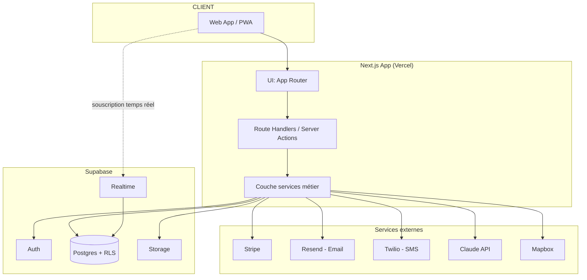

# ARCHITECTURE.md — Plateforme de conciergerie premium

## 1. Principes directeurs

- **Modularité** : chaque domaine métier (Requests, Proposals, Bookings, Payments, Messaging, Partners, Notifications) est isolé dans sa propre couche de service, même si le déploiement est un monolithe. Extraction future possible sans réécriture.
- **Sécurité par défaut** : RBAC vérifié côté serveur *et* en base (RLS). Aucun secret côté client. Aucune donnée bancaire stockée.
- **Pas de sur-ingénierie au MVP** : on choisit des services managés pour tout ce qui n'est pas le cœur différenciant du produit (le workflow de conciergerie).
- **Originalité** : aucune réutilisation de code, design, textes ou visuels de conciergeries existantes. Seule la logique de parcours (demande → prise en charge → proposition → validation → réservation → paiement → suivi → fidélisation) sert de référence fonctionnelle publique.

## 2. Comparatif des choix de stack

### 2.1 Frontend + Backend : monolithe Next.js vs Next.js + NestJS séparé

| Critère | Next.js seul (Route Handlers + Server Actions) | Next.js + NestJS séparé |
|---|---|---|
| Vitesse de mise en œuvre MVP | ✅ Rapide, un seul repo/déploiement | ❌ Deux services à opérer dès le jour 1 |
| SEO / landing page (SSR/ISR) | ✅ Natif | ✅ Next.js toujours en frontal |
| Séparation des responsabilités | Correcte si discipline de code (`/server/services`) | ✅ Forcée par l'architecture |
| Coût opérationnel (hébergement, CI/CD) | ✅ Faible | ❌ Plus élevé |
| Pertinent pour une équipe réduite / startup | ✅ | Seulement si équipe backend dédiée |

**Décision : Next.js 15 (App Router) monolithique.** La séparation NestJS est reportée à un « déclencheur » explicite : si un client mobile natif consomme la même API que plusieurs frontends indépendants, ou si l'équipe backend dépasse ce qu'un monorepo Next.js peut raisonnablement porter.

### 2.2 Base de données / plateforme de données : Supabase vs Postgres auto-hébergé

| Critère | Supabase (Postgres managé + Auth + Storage + Realtime) | Postgres auto-hébergé (Docker) + Socket.io + S3 |
|---|---|---|
| Temps d'implémentation Auth | ✅ Intégré | ❌ À construire (Auth.js + tables) |
| Temps réel (messagerie) | ✅ Realtime intégré, pas de serveur à opérer | ❌ Nécessite un serveur Node long-lived (incompatible avec du pur serverless Vercel) |
| Stockage fichiers | ✅ Storage S3-compatible intégré | ❌ Config S3/MinIO séparée |
| RBAC | Row Level Security nativement liée à `auth.uid()` | RBAC 100% applicatif, RLS possible mais plus de câblage manuel |
| Portabilité / lock-in | Moyen (reste du Postgres standard, migration possible) | Nulle (tout est à soi) |
| Coût à l'échelle | Prévisible par palier | Plus de contrôle mais plus de maintenance |

**Décision : Supabase.** Pour une conciergerie premium en phase MVP/startup, réduire la surface DevOps (pas de serveur WebSocket à maintenir, pas de bucket S3 à sécuriser à la main) est plus précieux que le contrôle total. Le schéma reste du SQL standard (voir DATABASE.md) : migration vers un Postgres auto-hébergé reste possible si nécessaire.

### 2.3 ORM : Drizzle vs Prisma

| Critère | Drizzle | Prisma |
|---|---|---|
| Proximité SQL / lisibilité des migrations | ✅ Très proche du SQL, facile à auditer (sécurité) | Moteur de requêtes propriétaire, migrations générées |
| Compatibilité edge runtime (middleware Next.js) | ✅ | Limitée (Prisma Accelerate nécessaire) |
| Écosystème / DX out-of-the-box | Bon, plus jeune | ✅ Plus mature, Prisma Studio |
| Typage TypeScript | ✅ Excellent | ✅ Excellent |

**Décision : Drizzle ORM.** Le critère décisif est l'auditabilité des migrations SQL (exigence de sécurité du projet) et la compatibilité edge.

### 2.4 Authentification : Supabase Auth vs Auth.js autonome

**Décision : Supabase Auth**, car le projet est déjà engagé sur Supabase pour la DB/Storage/Realtime. Utiliser Supabase Auth permet aux policies RLS d'utiliser nativement `auth.uid()` sans synchroniser deux systèmes d'identité. Une table `profiles` étend `auth.users` avec le rôle métier (`client`, `concierge`, `admin`, `partner`) et les données propres à l'app.

### 2.5 Temps réel : Supabase Realtime vs Socket.io vs Pusher

**Décision : Supabase Realtime** (Postgres Changes + Broadcast). Élimine le besoin d'un serveur Socket.io dédié, ce qui permet de déployer 100% sur Vercel (serverless) sans compromis sur le temps réel. Pusher reste une alternative si Supabase Realtime montre des limites à l'usage (à réévaluer en Phase 11).

### 2.6 Hébergement : Vercel vs Docker sur Fly.io/Railway

**Décision : Vercel** pour l'app Next.js (DX, preview deployments par PR, edge network, intégration native Next.js). Docker reste utilisé en local (docker-compose avec Postgres local) pour la reproductibilité des tests et de l'environnement de dev, et pourra héberger un futur service séparé (worker, NestJS) si besoin.

### 2.7 Autres services

| Besoin | Choix | Alternative envisagée |
|---|---|---|
| Emails transactionnels | **Resend** + React Email | Postmark, SendGrid |
| SMS | **Twilio** (Phase 11, non-MVP) | Vonage |
| Paiement | **Stripe** (Checkout + Payment Intents + Customer Portal) | — (pas d'alternative sérieuse pour ce niveau d'exigence) |
| Cartes / géolocalisation | **Mapbox** (différé, Phase post-MVP) | Google Maps |
| IA | **Claude API (Anthropic)** en couche assistance uniquement | OpenAI |
| Jobs planifiés / rappels | **Vercel Cron** + Supabase Edge Functions | Inngest (si la complexité des workflows async augmente) |

## 3. Vue d'ensemble modulaire



### Modules métier (couche `/server/services`)

```
auth        — session, RBAC, guards
users       — profils client/concierge/admin/partenaire
requests    — cœur métier : cycle de vie de la demande
proposals   — création/envoi/comparaison des options
bookings    — réservations liées aux propositions acceptées
payments    — Stripe : paiement, acompte, remboursement, facture
messaging   — messages client↔concierge + notes internes
partners    — mini-CRM partenaires
notifications — événements → email/SMS/push/in-app
subscriptions — plans FREE/PREMIUM/VIP/PRIVATE
reviews     — notation post-prestation
admin       — statistiques, gestion globale
ai          — classification, résumé, suggestions (assistance uniquement)
```

## 4. RBAC

Rôles : `client`, `concierge`, `admin`, `partner`. Un utilisateur a exactement un rôle (pas de cumul au MVP — un admin qui veut tester le parcours client utilise un compte de test séparé, cela évite une matrice de permissions combinatoire inutile au lancement).

Double vérification systématique :
1. **Applicatif** : chaque Server Action / Route Handler vérifie `session.role` avant d'exécuter une opération (fonction `assertRole()` centralisée, jamais de vérification dupliquée ad hoc).
2. **Base de données (RLS)** : chaque table sensible a une policy `USING` restrictive par défaut. Exemple pour `requests` :
   - `client` : `client_id = auth.uid()`
   - `concierge` : `concierge_id = auth.uid() OR (status = 'NEW' AND concierge_id IS NULL)`
   - `admin` : accès complet via un rôle Postgres dédié (service role côté serveur uniquement, jamais exposé au client)
   - `partner` : lecture seule sur les bookings/requests qui lui sont routés

Cette double couche est non négociable : la clé Supabase `anon` étant exposée côté client, une RLS mal écrite est une fuite de données immédiate.

## 5. Machine à états — `Request`

```
NEW → ASSIGNED → IN_PROGRESS → RESEARCHING → PROPOSAL_DRAFT → PROPOSAL_SENT
    → WAITING_CLIENT → (ACCEPTED | REJECTED) → BOOKING → CONFIRMED → COMPLETED

CANCELLED accessible depuis n'importe quel état sauf COMPLETED
REJECTED  → peut revenir à RESEARCHING (nouvelle proposition) ou finir à CANCELLED
```

Les transitions sont définies dans une table de transitions autorisées côté serveur (`server/services/requests/stateMachine.ts`) — **jamais** appliquées uniquement par l'UI. Chaque transition est journalisée dans `request_status_history` (acteur, ancien statut, nouveau statut, note, horodatage).

## 6. Notifications — architecture événementielle

Chaque action métier émet un événement interne (`REQUEST_CREATED`, `PROPOSAL_SENT`, `PAYMENT_SUCCESS`, etc. — liste complète dans le brief). Un dispatcher central (`server/services/notifications/dispatcher.ts`) route l'événement vers un ou plusieurs canaux (email/SMS/push/in-app) selon les préférences utilisateur et le type d'événement. Le canal in-app s'appuie sur Supabase Realtime pour l'affichage instantané ; email/SMS sont envoyés via des Route Handlers appelés en tâche asynchrone (pas de blocage de la requête utilisateur).

## 7. Sécurité (résumé — détail en Phase 14 dans SECURITY.md)

- Validation systématique **serveur** (Zod) même quand la validation frontend existe déjà.
- Rate limiting sur les routes sensibles (login, création de demande, envoi de message) via Upstash Redis ou l'équivalent Supabase.
- Upload de fichiers : validation du type MIME réel (pas seulement l'extension), taille max, scan antivirus différé si volumétrie le justifie, URLs signées à durée limitée (Supabase Storage).
- Aucune donnée bancaire en base — uniquement des références Stripe (`stripe_payment_intent_id`, `stripe_customer_id`).
- Tous les secrets en variables d'environnement, jamais commités (voir `.env.example` en Phase 1).
- Logs d'audit sur les actions sensibles (changement de rôle, remboursement, suppression de compte).

## 8. RGPD (résumé — détail en Phase 14)

- Consentement cookies (bandeau, choix « essentiel uniquement » par défaut).
- Suppression de compte = soft-delete (`deleted_at`) puis purge différée, pas de suppression en cascade destructrice immédiate qui casserait l'intégrité des factures/bookings historiques (obligation comptable).
- Export des données personnelles en JSON téléchargeable depuis le profil.
- Politique de confidentialité et CGU rédigées en propre (jamais copiées).

## 9. Structure des dossiers (Next.js App Router)

```
/app
  /(marketing)          → landing page publique (SEO, SSR/ISR)
  /(auth)                → login, signup, reset password
  /(client)              → espace client
  /(concierge)           → espace concierge
  /(admin)               → back-office admin
  /(partner)              → espace partenaire
  /api                   → webhooks (Stripe, etc.) uniquement — le reste passe par Server Actions
/components
  /ui                    → design system (Button, Input, Modal, Card, ...)
  /features              → composants liés à un module (RequestCard, ProposalCard, ChatMessage, ...)
/server
  /services              → logique métier par domaine (requests, proposals, bookings, ...)
  /db                     → schéma Drizzle, migrations, client DB
  /auth                   → helpers de session et guards RBAC
/lib                     → utilitaires transverses (formatage, dates, constants)
/types                   → types partagés
/hooks                   → hooks React réutilisables
/tests
  /unit
  /integration
  /e2e
/public
/docs                    → README, ARCHITECTURE.md, DATABASE.md, etc.
```

## 10. Décision d'infrastructure de test local

Docker Compose fournit un Postgres local pour les tests d'intégration (isolé de l'instance Supabase de production/staging), afin que les tests ne dépendent jamais d'un service externe payant ou partagé.

## 11. Note Next.js 16 (mise à jour post-scaffold)

Le scaffold initial (Phase M0) a installé **Next.js 16.3.4** — la version stable au moment de la création du projet, plus récente que le 15 envisagé au moment de l'audit. Next.js 16 introduit des changements de rupture par rapport à 15 ; décisions actées pour ce projet :

- **`cacheComponents` reste désactivé** (défaut). Cette app est presque entièrement dynamique et authentifiée (dashboards, demandes, messages par utilisateur) : le modèle "Cache Components" (`'use cache'` + `<Suspense>` obligatoire partout) apporterait de la complexité sans bénéfice réel ici. Seule la landing page publique (Phase M4) pourra éventuellement en tirer parti plus tard (revalidation ISR classique suffit pour l'instant).
- **`middleware.ts` est renommé `proxy.ts`** dans cette version (export `proxy()` au lieu de `middleware()`). Le guard RBAC de la Phase M2 sera donc écrit dans `src/proxy.ts`. Le runtime `edge` n'est plus disponible pour ce fichier (uniquement `nodejs`), ce qui convient puisque nos vérifications de session passent par le SDK serveur Supabase.
- **APIs asynchrones obligatoires** : `params`, `searchParams`, `cookies()`, `headers()` sont toujours des `Promise` à `await` — jamais d'accès synchrone. Les types générés `PageProps<'/route'>` / `LayoutProps<'/route'>` / `RouteContext` (via `next typegen`, déjà actif dans ce projet) doivent être utilisés systématiquement plutôt que des types de props écrits à la main.
- **`next lint` est supprimé** : le script `lint` du `package.json` appelle directement `eslint` (flat config), déjà en place dans le scaffold.
- **Turbopack est le bundler par défaut** pour `dev` et `build` — aucun flag `--turbopack` à ajouter.

## 12. Prochaine réévaluation

Ce document sera mis à jour à chaque décision structurante (voir DECISIONS.md, créé en Phase 13+). Toute dérogation aux choix ci-dessus doit être justifiée et documentée, pas silencieusement contournée.
