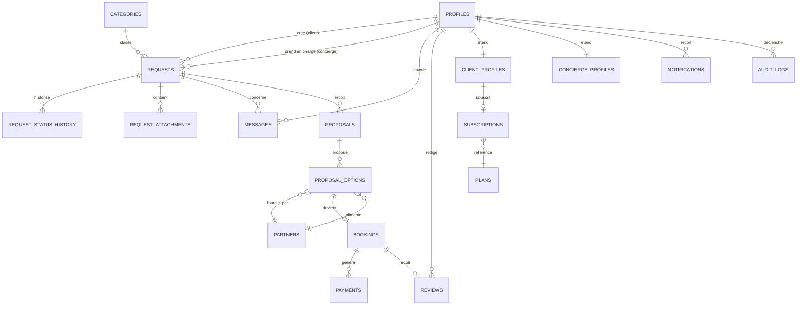

# DATABASE.md — Schéma de données

**Moteur :** PostgreSQL (Supabase) · **ORM :** Drizzle · **Sécurité :** Row Level Security activée sur toutes les tables métier.

## 1. Vue d'ensemble (ERD)



## 2. Tables

### `profiles`
Étend `auth.users` (Supabase Auth). Une ligne = un utilisateur applicatif.

| Colonne | Type | Notes |
|---|---|---|
| id | uuid PK | = `auth.users.id` |
| role | enum(`client`,`concierge`,`admin`,`partner`) | un seul rôle par utilisateur au MVP |
| email | text | dupliqué depuis `auth.users` par le trigger `handle_new_user` — évite de dépendre de la service role key pour les notifications (M11) |
| first_name | text | |
| last_name | text | |
| phone | text | nullable |
| avatar_url | text | nullable |
| locale | text | défaut `fr` |
| created_at | timestamptz | |
| updated_at | timestamptz | |
| deleted_at | timestamptz | nullable — soft delete RGPD |

### `client_profiles`
| Colonne | Type | Notes |
|---|---|---|
| profile_id | uuid PK/FK → profiles.id | |
| preferences | jsonb | préférences libres (cuisine, style de voyage, etc.) |
| loyalty_points | integer | défaut 0 |
| subscription_id | uuid FK → subscriptions.id | nullable |

### `concierge_profiles`
| Colonne | Type | Notes |
|---|---|---|
| profile_id | uuid PK/FK → profiles.id | |
| bio | text | |
| specialties | text[] | ex: `{restaurant, voyage}` |
| active | boolean | défaut true |
| max_active_requests | integer | limite de charge |

### `categories`
| id | slug | name | icon | active |
|---|---|---|---|---|
Restaurant, Voyage, Hôtel, Transport, Événement, Expérience, Bien-être, Shopping, Lifestyle, Autre (seed de départ, modifiable par l'admin).

### `requests` — entité centrale
| Colonne | Type | Notes |
|---|---|---|
| id | uuid PK | |
| client_id | uuid FK → profiles.id | |
| concierge_id | uuid FK → profiles.id | nullable tant que non assignée |
| category_id | uuid FK → categories.id | |
| title | text | |
| description | text | |
| location_text | text | |
| location_lat / location_lng | double precision | nullable, ajouté post-MVP (Mapbox) |
| requested_date | date | nullable |
| requested_time | time | nullable |
| budget_min / budget_max | numeric | nullable |
| preferences | text | nullable — étape 6 du wizard (brief §10), distinct de la description libre |
| priority | enum(`low`,`normal`,`high`,`urgent`) | défaut `normal` |
| status | enum (voir ARCHITECTURE.md §5) | défaut `NEW` |
| created_at / updated_at | timestamptz | |

Index : `(status)`, `(concierge_id)`, `(client_id)`, `(category_id, status)`.

### `request_status_history`
| id | request_id FK | from_status | to_status | changed_by FK profiles | note | created_at |

### `request_attachments`
| id | request_id FK | uploaded_by FK profiles | storage_path | file_name | mime_type | size_bytes | created_at |

### `messages`
| Colonne | Type | Notes |
|---|---|---|
| id | uuid PK | |
| request_id | uuid FK → requests.id | |
| sender_id | uuid FK → profiles.id | |
| body | text | |
| attachments | jsonb | liste d'URLs Storage |
| is_internal_note | boolean | défaut false — `true` = visible concierge/admin uniquement |
| read_at | timestamptz | nullable |
| created_at | timestamptz | |

Index : `(request_id, created_at)`.

### `proposals`
| id | request_id FK | concierge_id FK | status enum(`draft`,`sent`,`accepted`,`rejected`) | sent_at | created_at |

### `proposal_options`
| Colonne | Type | Notes |
|---|---|---|
| id | uuid PK | |
| proposal_id | uuid FK → proposals.id | |
| partner_id | uuid FK → partners.id | nullable |
| name | text | |
| description | text | |
| photos | jsonb | URLs Storage |
| price | numeric | |
| currency | text | défaut `EUR` |
| scheduled_at | timestamptz | nullable |
| address | text | nullable |
| conditions | text | nullable |
| advantages | text | nullable |
| is_selected | boolean | défaut false |
| client_feedback | text | nullable |

### `bookings`
| id | request_id FK | proposal_option_id FK | client_id FK | partner_id FK nullable | status enum(`pending`,`confirmed`,`cancelled`,`completed`) | scheduled_at | created_at |

### `payments`
| Colonne | Type | Notes |
|---|---|---|
| id | uuid PK | |
| booking_id | uuid FK → bookings.id | |
| client_id | uuid FK → profiles.id | |
| stripe_payment_intent_id | text | jamais de données carte |
| type | enum(`deposit`,`full`,`refund`) | |
| amount | numeric | |
| currency | text | |
| commission_amount | numeric | part plateforme |
| status | enum(`pending`,`succeeded`,`failed`,`refunded`) | |
| invoice_url | text | nullable — généré via Stripe |
| created_at | timestamptz | |

### `plans`
| id | code enum(`free`,`premium`,`vip`,`private`) | name | price_monthly | request_limit | dedicated_concierge boolean | features jsonb |

### `subscriptions`
| id | client_id FK | plan_id FK | stripe_subscription_id | status | current_period_end | created_at |

### `partners`
| Colonne | Type | Notes |
|---|---|---|
| id | uuid PK | |
| profile_id | uuid FK → profiles.id, nullable, unique | lie le partenaire à un compte (rôle `partner`) pour l'auto-service en Phase M13 ; nullable tant qu'aucun compte n'existe encore |
| name | text | |
| category_id | uuid FK → categories.id | |
| contact_name | text | |
| email | text | |
| phone | text | |
| address | text | |
| website | text | nullable |
| commission_rate | numeric | pourcentage |
| status | enum(`active`,`inactive`,`pending`) | |
| notes | text | nullable |
| created_at | timestamptz | |

### `notifications`
| id | user_id FK profiles | type enum (liste ARCHITECTURE.md §6) | channel enum(`email`,`sms`,`push`,`in_app`) | payload jsonb | read_at | sent_at | created_at |

Index : `(user_id, read_at)`.

### `reviews`
| id | booking_id FK | client_id FK | rating smallint (1-5) | comment text nullable | created_at |

### `audit_logs`
| id | actor_id FK profiles | action text | entity_type text | entity_id uuid | metadata jsonb | created_at |

## 2 bis. Agent IA (F&T et assistant du Gérant) — tables ajoutées

Ajoutées **à côté** des tables de Conciergerie Premium ci-dessus, jamais à leur place. 16 tables,
migrations `0015` à `0026`. Source de vérité : `src/server/db/schema.ts` (section « Agent IA »).
Contexte et décisions : `docs/cahier-des-charges-v2.md`, `DECISIONS.md`.

**Nommage.** Noms en français, comme dans le cahier des charges. Seule exception : `message` du
cahier devient `message_agent`, car `messages` (Premium) existe déjà avec un autre sens.

**Colonne `activite`** (enum `ft` / `premium` / `commun`) sur `regle`, `fiche_connaissance`,
`message_agent`, `action` et `demande`. **Sans valeur par défaut** (migration `0024`) : tout
écrivain doit la renseigner. `demande.activite` n'accepte pas `commun`. Ne pas la confondre avec
`regle.domaine` (thème : communication, finance…).

### Tables utilisées par le code

| Table | Rôle | Points d'attention |
|---|---|---|
| `demande` | Boîte de réception du Gérant : message reçu, brouillon, réponse finale | `statut` : `nouveau`, `brouillon_pret`, `valide`, `corrige`, `escalade`. `traite_le` non nul = clôturée (une seule fois). `fiches_utilisees` (jsonb) garde les fiches lues, pour la traçabilité. `categorie_escalade` + `escalade_urgente` permettent de compter les transmissions par motif. `logement_id` facultatif, F&T seulement. Le message y est **déjà masqué** de toute donnée bancaire. |
| `fiche_connaissance` | Ce que l'assistant a le droit de dire | `logement_id` nul = fiche générale de l'activité. **Versionnée, jamais modifiée en place** : une ligne par version. Unicité par section et version (deux index partiels, migration `0026`). Sections définies dans `src/lib/agent/fiches-modele.ts`. |
| `action` | Le journal | **Écriture seule, imposée par un déclencheur** (aucun update, delete ni truncate, même avec la clé de service). Aucune policy d'écriture. Lecture réservée à l'admin. |
| `regle` | Le cadre de décision et l'autonomie par tâche | Unique par `(activite, domaine, tache)`. `niveau_autonomie` : `propose`, `agit_apres_validation`, `agit_seul`. |
| `logement` | Un logement F&T | `statut` : `inactif` (défaut) ou `actif`. Activation refusée tant que les sections accès, équipements, règles et dépannage ne sont pas remplies. FK vers `proprietaire` en `restrict`. |
| `proprietaire` | Propriétaire, prospect ou client | Même table, seul `statut` change (`prospect`, `en_discussion`, `client`, `perdu`). |
| `bien_prospect` | Bien d'un prospect (qualification) | Alimenté par le chat public de prospection (désactivé). |
| `message_agent` | Messages du chat de prospection | Auteur : `voyageur`, `agent`, `gerant`, `proprietaire`. |
| `rendez_vous` | Rendez-vous proposés par le chat de prospection | |

### Tables créées mais pas encore utilisées

`secret_logement` (codes d'accès chiffrés — le chiffrement n'est pas écrit), `reservation`,
`voyageur`, `incident`, `menage`, `prestataire`, `lien_acces`. Elles attendent les lots L2 à L5 du
cahier d'origine ; ne pas les supposer alimentées.

### Sécurité par ligne

Les 16 tables ont la RLS activée et **une seule policy**, réservée à l'admin
(`current_app_role() = 'admin'`) ; `action` n'a qu'une policy en lecture. L'agent lit et écrit par la
clé de service côté serveur, **après** `assertRole("admin")`. Vérification rejouable :
`test/securite/rls-audit.sql`.

### Migrations de l'agent

| N° | Contenu |
|---|---|
| `0015` | Schéma des 15 premières tables (lot L0) |
| `0016` | RLS de ces tables |
| `0017` | Règles de départ (7 tâches, niveaux du cahier des charges) |
| `0018`, `0019`, `0021` | Règles du chat de prospection ; fiche offre F&T (version 1) |
| `0020` | Auteur `proprietaire` pour `message_agent` |
| `0022` | Enums `activite` et `demande_status`, colonne `activite`, table `demande`, unicité des règles par activité |
| `0023` | RLS de `demande` ; verrou du journal |
| `0024` | Retire la valeur par défaut de `activite` |
| `0025` | `categorie_escalade`, `escalade_urgente` |
| `0026` | Unicité des versions de fiche |

Appliquées sur la base de **dev** (`concierge-app-dev`) ; **pas** sur la production. Procédure et
pièges : `docs/exploitation-agent.md`.

## 3. Row Level Security — principe (détail SQL en Phase 3)

Toutes les tables listées ci-dessus ont `ROW LEVEL SECURITY` activé avec une politique `deny by default`. Exemple de politique pour `requests` :

```sql
-- Lecture : le client voit ses propres demandes
create policy "client_read_own_requests"
on requests for select
using (client_id = auth.uid());

-- Lecture : le concierge voit ses demandes assignées + les nouvelles non assignées
create policy "concierge_read_relevant_requests"
on requests for select
using (
  concierge_id = auth.uid()
  or (status = 'NEW' and concierge_id is null)
);

-- Écriture : seul le concierge assigné (ou un admin via service role) peut modifier
create policy "concierge_update_own_requests"
on requests for update
using (concierge_id = auth.uid());
```

Le rôle `admin` opère via la **service role key** côté serveur uniquement (jamais exposée au client), qui bypass RLS — l'accès admin passe donc toujours par nos Server Actions, jamais directement depuis le navigateur.

## 4. Conventions

- Toutes les PK sont des `uuid` (`gen_random_uuid()`), pas d'auto-increment séquentiel exposé (évite l'énumération d'IDs).
- Tous les timestamps en `timestamptz`, jamais `timestamp` nu.
- Toute table métier a `created_at`, et `updated_at` géré par trigger (`updated_at = now()` on update).
- Suppression = soft-delete (`deleted_at`) sur `profiles` uniquement pour le MVP (obligation RGPD) ; les autres tables suivent en Phase 14 si besoin d'un droit à l'oubli plus large.

## 5. Ce qui n'est PAS dans le schéma MVP (volontairement différé)

- Table de permissions granulaire (ABAC) — le rôle unique par utilisateur suffit au MVP.
- Colonnes de géolocalisation exploitées (champ présent mais non utilisé tant que Mapbox n'est pas intégré).
- Table `partner_offers` (offres proactives des partenaires) — mentionnée dans le brief §16 mais pas nécessaire avant que le CRM partenaires de base fonctionne.

Ces éléments sont `NOT IMPLEMENTED` intentionnellement — voir ROADMAP.md.
